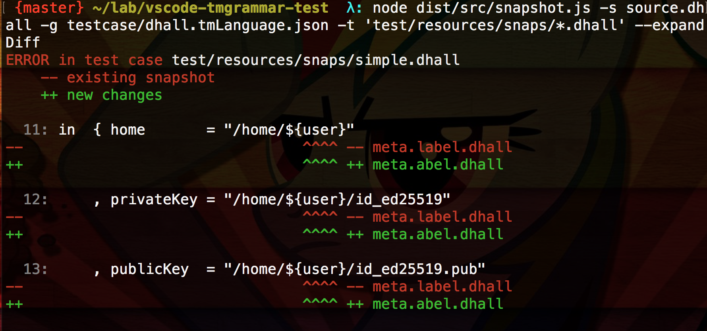

## VSCode Textmate grammar test

Provides a way to test textmate grammars against a vscode engine using user-friendly plaintext files.

* Unit tests:


* Snapshot tests:



Inspired by [Sublime Text syntax tests](https://www.sublimetext.com/docs/3/syntax.html#testing)


### Installation

As a project dependency:

```bash
npm i --save vscode-tmgrammar-test
```

Or as a standalone command line tool:

```bash
npm i -g vscode-tmgrammar-test
vscode-tmgrammar-test --help
```


### Unit tests

```scala
// SYNTAX TEST "source.scala" "sample testcase"

// line which start with a <comment token> but don't have valid assertions are ignored

class Stack[A] {
// <-----  keyword.declaration.scala
//   ^ - keyword.declaration.scala entity.name.class.declaration
//    ^^^^^  entity.name.class.declaration
//         ^  source.scala meta.bracket.scala
//          ^  entity.name.class
//           ^  meta.bracket.scala
//             ^  punctuation.section.block.begin.scala
  private var elements: List[A] = Nil
    def push(x: A) { elements = x :: elements }
    def peek: A = elements.head
    def pop(): A = {
      val currentTop = peek
      elements = elements.tail
      currentTop
  }
// <~~- punctuation.section.block.end.scala
}

```

To write a unit test:

* include a header line:

```
<comment token> SYNTAX TEST "<language scope>" "optional description"
```

* Require tokens to have specific scope by using `^`&nbsp;&nbsp;:

```scala
private var elements: List[A] = Nil
//          ^^^^^^^^ variable.other.declaration.scala
```

* Get into those pesky first few characters by using `<-`:

```scala
var x = 3
// <--- keyword.declaration.volatile.scala
//  the length of '-' determine how many characters are matched from the start of the line
x=5
//  <~- keyword.operator.comparison.scala
//  you specify offset from start by using '~' character, just in case
```

* Ensure that tokens **don't** have undesired scopes by using&nbsp;&nbsp; `- scopes`&nbsp;:
```scala
   // ensure comment start with two double slashes
  ^ - comment.line.double-slash.scala punctuation.definition.comment.scala
```

Any lines which start with a `<comment token>` will be ignored by the textmate grammar.


Note, that scope comparison takes into account relative scope's position.
So, if required scopes are `'scope1 scope2'`, the test will report an error if a grammar returns them as `'scope2 scope1'`.

### Snapshot tests
Snapshot tests are like `functional tests` but you don't have to write outputs explicitly.
All you have to do is to provide a source files, scopes of which you want to test. Then on
the first run `vscode-tmgrammar-snap` will generate a set of `.snap` files which are an
instant snapshot of lines of the source files together with corresponding scopes.

Then if you change the grammar and run the test again, the program will output the changes between
the `.snap` file and the real output.
If you satisfied with the changes you can `commit` them by running
```bash
vscode-tmgrammar-snap .... --updateSnapshot
```
this will overwrite the existing `.snap` files with a new ones.
After this you should commit them alongside with the source code test cases.

You can read more about them at [snapshot testing](https://jestjs.io/docs/en/snapshot-testing)


### Command Line Options

* Unit tests:
```
Usage: vscode-tmgrammar-test [options]

Run Textmate grammar test cases using vscode-textmate

Options:
  -V, --version            output the version number
  -s, --scope <scope>      Language scope, e.g. source.dhall
  -g, --grammar <grammar>  Path to a grammar file, either .json or .xml. This option can be specified multiple times if multiple grammar needed. (default: [])
  -t, --testcases <glob>   A glob pattern which specifies testcases to run, e.g. "./tests/**/test*.dhall". Quotes are important!
  -c, --compact            Display output in the compact format, which is easier to use with VSCode problem matchers
  -h, --help               output usage information
```

* Snapshot tests:
```
Usage: vscode-tmgrammar-snap [options]

Run VSCode textmate grammar snapshot tests

Options:
  -V, --version            output the version number
  -s, --scope <scope>      Language scope, e.g. source.dhall
  -g, --grammar <grammar>  Path to a grammar file, either .json or .xml. This option can be specified multiple times if multiple grammar needed. (default: [])
  -t, --testcases <glob>   A glob pattern which specifies testcases to run, e.g. "./tests/**/test*.dhall". Quotes are important!
  -u, --updateSnapshot     overwrite all snap files with new changes
  --printNotModified       include not modified scopes in the output
  --expandDiff             produce each diff on two lines prefixed with "++" and "--"
  -h, --help               output usage information
```

Example:

```bash
> vscode-tmgrammar-test -s source.dhall -g testcase/dhall.tmLanguage.json -t "**/*.dhall"
```

### Setup VSCode unit test task

You can setup a vscode unit test task for convenience:

```json
{
            "label": "Run tests",
            "type": "shell",
            "command": "vscode-tmgrammar-test -c -s source.dhall -g testcase/dhall.tmLanguage.json -t \"**/*.dhall\"",
            "group": "test",
            "presentation": {
                "reveal": "always",
                "panel":"new"
            },
            "problemMatcher": {
                "fileLocation": [
                    "relative",
                    "${workspaceFolder}"
                ],
                "pattern": [
                    {
                        "regexp": "^(ERROR)\\s([^:]+):(\\d+):(\\d+):(\\d+)\\s(.*)$",
                        "severity": 1,
                        "file": 2,
                        "line": 3,
                        "column": 4,
                        "endColumn": 5,
                        "message": 6

                    }
                ]
            }
        }
```

Notice the `-c` option that will output messages in a handy format for the problemMatcher.

Result:


